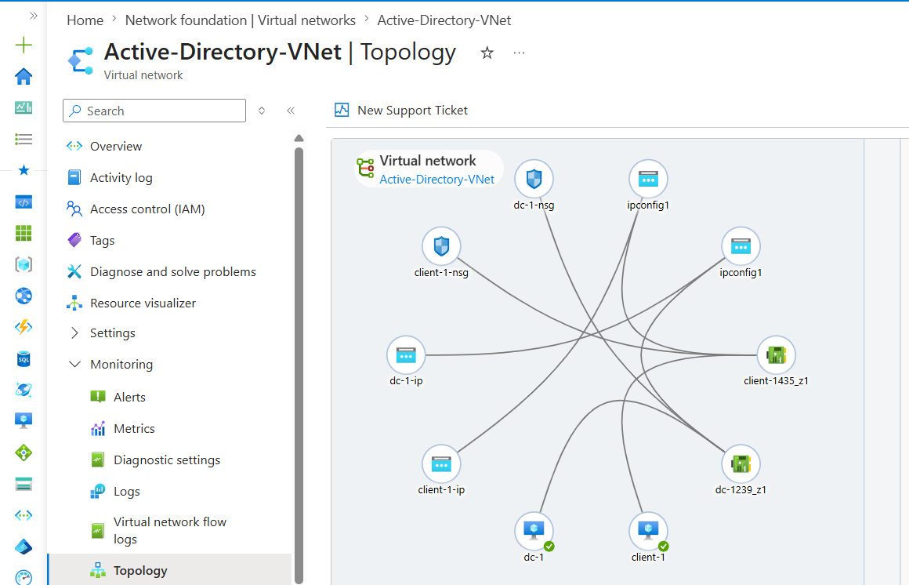
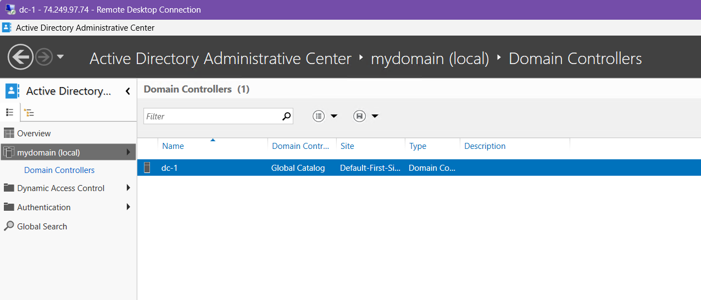
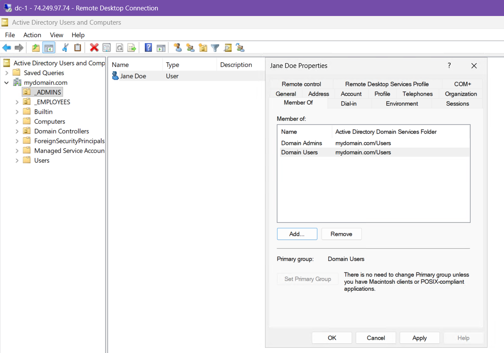
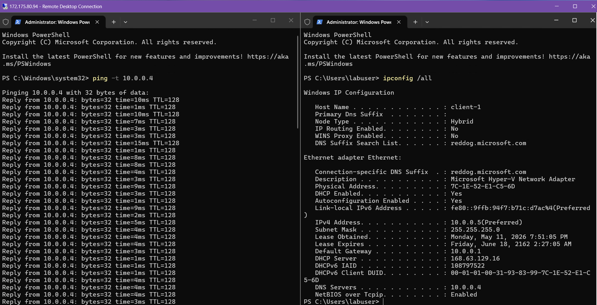
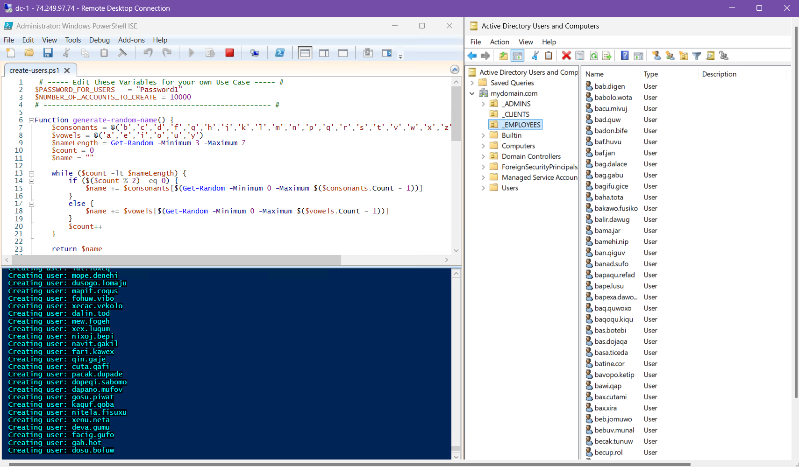

# Active Directory & Network Identity Management in Azure

## Introduction
This project demonstrates the deployment and configuration of a functional Windows-based corporate network within Microsoft Azure. By establishing a Domain Controller (DC) and integrating client workstations, the environment simulates real-world identity management and network security scenarios. The objectives include implementing Active Directory Domain Services (AD DS), automating user provisioning via PowerShell, and enforcing security policies such as Account Lockout Thresholds. This project serves as a practical application of cloud networking, centralized administration, and defensive security posture management.

---

## Technical Skills & Tools
* **Cloud Infrastructure:** Provisioning Virtual Networks (VNet), Subnets, and Network Security Groups (NSG) in Azure.
* **Identity Management:** Installing and promoting Domain Controllers; managing Objects, Organizational Units (OUs), and Security Groups.
* **Automation:** Utilizing PowerShell scripts to generate high-volume test users for scalability testing.
* **Security Policy Enforcement:** Configuring Group Policy Objects (GPOs) to mitigate brute-force attack vectors.
* **Networking & Troubleshooting:** Managing DNS settings for domain join operations and verifying connectivity via ICMP.
* **Logging & Monitoring:** Analyzing Event Viewer logs on both the Domain Controller and Client for security auditing.

---

## Part 1: Infrastructure Deployment & Active Directory Setup

The objective of this phase was to deploy the necessary virtual infrastructure in Azure and establish the primary Domain Controller to manage identity and access for the environment.

### 1. Cloud Networking & Instance Provisioning
* **Virtual Network Configuration:** Established a dedicated Resource Group and Virtual Network (VNet) to facilitate private communication between cloud assets.
* **IP Addressing:** Configured a **Static Private IP address** for the Domain Controller's Network Interface Card (NIC) to ensure persistent DNS availability for the client workstation.

  
   
  <i>Figure 2: Logical topology of the Virtual Network and Subnet configuration in Azure.</i>

### 2. Domain Controller Promotion
* **Role Installation:** Deployed **Active Directory Domain Services (AD DS)** on DC-1 (Windows Server 2022) to serve as the centralized authentication authority.
* **Forest Creation:** Promoted the server to a Domain Controller for the `mydomain.com` forest, initializing the directory database and core identity services.

  
   
  <i>Figure 3: Verification of Active Directory Domain Services installation and forest health.</i>

### 3. Administrative Hierarchy & Identity Management
* **OU Structure:** Designed an Organizational Unit (OU) hierarchy including `_EMPLOYEES` and `_ADMINS` to facilitate efficient object management and Group Policy application.
* **Administrative Provisioning:** Created a dedicated Domain Admin account (`jane_admin`), adhering to the professional standard of using named administrative accounts rather than built-in local accounts.

  
   
  <i>Figure 4: Organizational Unit (OU) layout and Domain Admin account provisioning in ADUC.</i>

---

## Part 2: Domain Integration & Automated User Provisioning

The focus of this phase was to establish a secure connection between the client workstation and the domain, followed by using automation to simulate a high-density corporate environment.

### 1. Network Synchronization & Domain Join
* **DNS Configuration:** Modified the DNS settings on the Client-1 workstation to point directly to the Domain Controller’s private IP. This step was critical for the client to resolve the `mydomain.com` forest name.
* **Workstation Integration:** Joined Client-1 to the domain using administrative credentials. Successful integration was verified by locating the computer object within the newly created `_CLIENTS` Organizational Unit in ADUC.

  
   
  <i>Figure 5: Verification of the workstation joining the domain and proper DNS resolution.</i>

### 2. Remote Desktop Protocol (RDP) Configuration
* **Access Control:** Enabled Remote Desktop on the client workstation and granted "Domain Users" permission to log in. 
* **User Accessibility:** This adjustment transitioned the system from restricted local access to a flexible model where non-administrative employees can access their environment from other network nodes.

  
   
  <i>Figure 6: Connectivity testing and RDP configuration for domain-wide accessibility.</i>

### 3. PowerShell Automation & Bulk Provisioning
* **Scripted Scalability:** Executed a PowerShell script to automate the creation of several thousand user accounts. Using automated scripts ensures consistency and eliminates human error during large-scale deployments.
* **Environment Stress Testing:** Populating the `_EMPLOYEES` OU with high-volume data provides a realistic environment for testing search performance, group policies, and administrative workflows.

  
   
  <i>Figure 7: Execution of the PowerShell script and observation of bulk account creation in Active Directory.</i>

---

