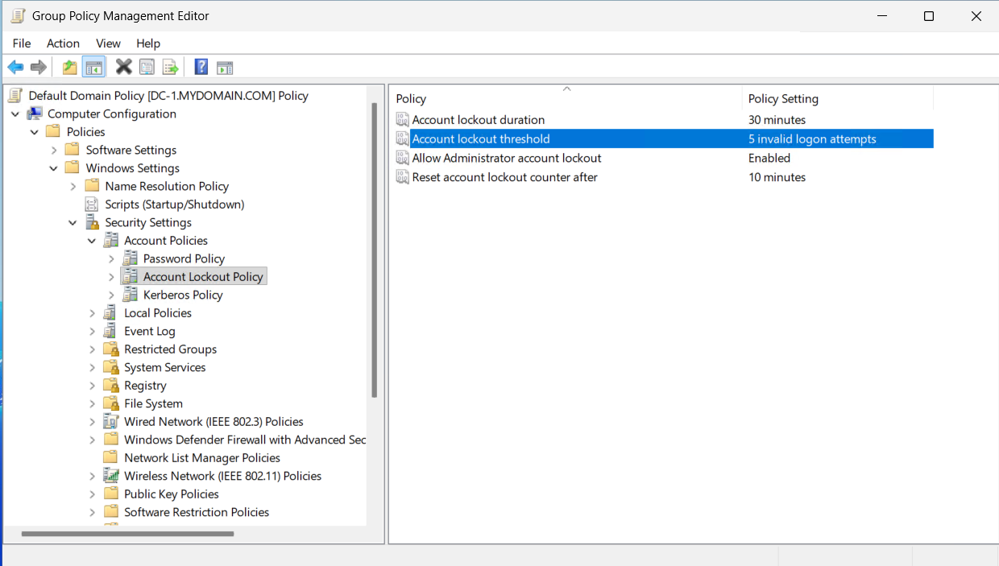
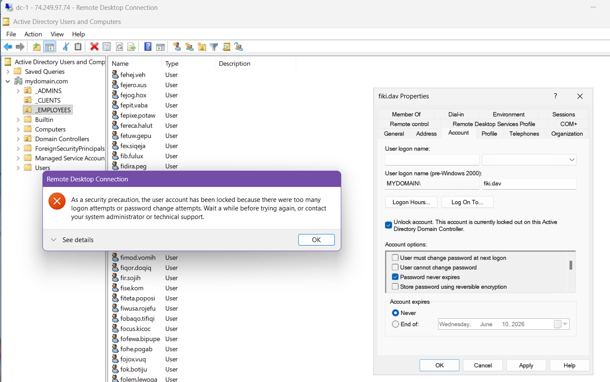

# Active Directory & Network Identity Management in Azure

## Introduction
This project demonstrates the deployment and configuration of a functional Windows-based corporate network within Microsoft Azure. By establishing a Domain Controller (DC) and integrating client workstations, the environment simulates real-world identity management and network security scenarios. The objectives include implementing Active Directory Domain Services (AD DS), automating user provisioning via PowerShell, and enforcing security policies such as Account Lockout Thresholds. This project serves as a practical application of cloud networking, centralized administration, and defensive security posture management.

---

## Technical Skills & Tools
* **Cloud Infrastructure:** Provisioning Virtual Networks (VNet), Subnets, and Network Security Groups (NSG) in Azure.
* **Identity Management:** Installing and promoting Domain Controllers; managing Objects, Organizational Units (OUs), and Security Groups.
* **Automation:** Utilizing PowerShell scripts to generate high-volume test users for scalability testing.
* **Security Policy Enforcement:** Configuring Group Policy Objects (GPOs) to mitigate brute-force attack vectors.
* **Networking & Troubleshooting:** Managing DNS settings for domain join operations and verifying connectivity via ICMP.
* **Logging & Monitoring:** Analyzing Event Viewer logs on both the Domain Controller and Client for security auditing.

---

## Part 1: Infrastructure Deployment & Active Directory Setup

The objective of this phase was to deploy the necessary virtual infrastructure in Azure and establish the primary Domain Controller to manage identity and access for the environment.

### 1. Cloud Networking & Instance Provisioning
* **Virtual Network Configuration:** Established a dedicated Resource Group and Virtual Network (VNet) to facilitate private communication between cloud assets.
* **IP Addressing:** Configured a **Static Private IP address** for the Domain Controller's Network Interface Card (NIC) to ensure persistent DNS availability for the client workstation.

  
   
  <i>Figure 2: Logical topology of the Virtual Network and Subnet configuration in Azure.</i>

### 2. Domain Controller Promotion
* **Role Installation:** Deployed **Active Directory Domain Services (AD DS)** on DC-1 (Windows Server 2022) to serve as the centralized authentication authority.
* **Forest Creation:** Promoted the server to a Domain Controller for the `mydomain.com` forest, initializing the directory database and core identity services.

  
   
  <i>Figure 3: Verification of Active Directory Domain Services installation and forest health.</i>

### 3. Administrative Hierarchy & Identity Management
* **OU Structure:** Designed an Organizational Unit (OU) hierarchy including `_EMPLOYEES` and `_ADMINS` to facilitate efficient object management and Group Policy application.
* **Administrative Provisioning:** Created a dedicated Domain Admin account (`jane_admin`), adhering to the professional standard of using named administrative accounts rather than built-in local accounts.

  
   
  <i>Figure 4: Organizational Unit (OU) layout and Domain Admin account provisioning in ADUC.</i>

---

## Part 2: Domain Integration & Automated User Provisioning

The focus of this phase was to establish a secure connection between the client workstation and the domain, followed by using automation to simulate a high-density corporate environment.

### 1. Network Synchronization & Domain Join
* **DNS Configuration:** Modified the DNS settings on the Client-1 workstation to point directly to the Domain Controller’s private IP. This step was critical for the client to resolve the `mydomain.com` forest name.
* **Workstation Integration:** Joined Client-1 to the domain using administrative credentials. Successful integration was verified by locating the computer object within the newly created `_CLIENTS` Organizational Unit in ADUC.

  
   
  <i>Figure 5: Verification of the workstation joining the domain and proper DNS resolution.</i>

### 2. Remote Desktop Protocol (RDP) Configuration
* **Access Control:** Enabled Remote Desktop on the client workstation and granted "Domain Users" permission to log in. 
* **User Accessibility:** This adjustment transitioned the system from restricted local access to a flexible model where non-administrative employees can access their environment from other network nodes.

  
   
  <i>Figure 6: Connectivity testing and RDP configuration for domain-wide accessibility.</i>

### 3. PowerShell Automation & Bulk Provisioning
* **Scripted Scalability:** Executed a PowerShell script to automate the creation of several thousand user accounts. Using automated scripts ensures consistency and eliminates human error during large-scale deployments.
* **Environment Stress Testing:** Populating the `_EMPLOYEES` OU with high-volume data provides a realistic environment for testing search performance, group policies, and administrative workflows.

  
   
  <i>Figure 7: Execution of the PowerShell script and observation of bulk account creation in Active Directory.</i>

---

## Part 3: Security Policy Enforcement & Account Security

This phase involved configuring defensive security controls to protect against common attack vectors and observing how the system responds to unauthorized access attempts.

### 1. Account Lockout Policy Implementation
* **Group Policy Configuration:** Utilized the Group Policy Management Editor to establish a formal **Account Lockout Policy**. The "Account lockout threshold" was set to 5 attempts, ensuring that a brute-force attack would be stopped automatically.
* **Security Hardening:** By enforcing these rules at the domain level, the organization ensures a consistent security posture across all workstations, preventing attackers from making unlimited password guesses.

  
   
  <i>Figure 8: Configuring the Account Lockout Threshold via Group Policy Objects.</i>

### 2. Brute-Force Simulation & Verification
* **Triggering Lockouts:** Conducted a test by intentionally entering incorrect passwords for a target user account. After the sixth failed attempt, the system successfully denied further access, confirming that the GPO was active and functional.
* **Active Directory Observation:** Verified the status of the locked account within **Active Directory Users and Computers**, observing the "Unlock account" flag was triggered as expected.

  
   
  <i>Figure 9: Observing a locked-out user state and performing a manual account unlock.</i>

### 3. Identity State Management
* **Account Disabling:** Practiced the standard security procedure of disabling an account to immediately revoke access without deleting the user's data. This is a common workflow for employee offboarding or during active security incidents.
* **Audit Trail Observation:** Analyzed the error messages presented to the user during disabled or locked states, noting how these events are captured within the Domain Controller's logs for future auditing.

---

## Part 4: Security Monitoring & Observability

The final phase of the project focused on the auditing capabilities of Windows and Active Directory, emphasizing the importance of logs in identifying and investigating security incidents.

### 1. Security Event Analysis
* **DC-1 Logging:** Accessed the **Event Viewer** on the Domain Controller to inspect Security Logs. Focused on **Event ID 4740** (A user account was locked out) and **Event ID 4625** (An account failed to log on), which provide the necessary data for identifying brute-force attempts.
* **Client-Side Auditing:** Examined local security logs on Client-1 to correlate workstation-level logon events with domain-level authentication records, ensuring a complete view of the authentication chain.

### 2. Operational Visibility
* **Log Correlation:** By observing the timestamp and source IP of failed login attempts, the lab demonstrated how security analysts can trace a lockout event back to a specific machine or user.
* **Proactive Monitoring:** This logging foundation is a precursor to implementing a SIEM (Security Information and Event Management) system, where these raw events would be ingested for real-time alerting.

---

## Project Outcome & Key Technical Competencies

This project successfully established a scalable and secure identity management environment within a cloud infrastructure. Key technical takeaways include:

* **Centralized Identity Governance:** Implementing AD DS to manage users and devices from a single source of truth.
* **Security Policy Enforcement:** Using Group Policy to automatically harden hundreds of workstations simultaneously against credential-based attacks.
* **Scalable Administration:** Demonstrating that PowerShell automation is essential for managing enterprise-level user databases without manual overhead.
* **Incident Detection Fundamentals:** Understanding how to utilize Windows Event Logs to troubleshoot connectivity issues and investigate security breaches.

---

## Conclusion & Cleanup

This lab provided a comprehensive look at the intersection of cloud networking, system administration, and defensive security. By building the environment from scratch, the nuances of DNS, static IP addressing, and the Domain Join process were thoroughly explored. 

To maintain cost-efficiency and security best practices, all virtual machines were shut down via the Azure Portal after the final verification. The resources remain intact for future labs involving Group Policy Objects (GPO) and more advanced security auditing.

---

